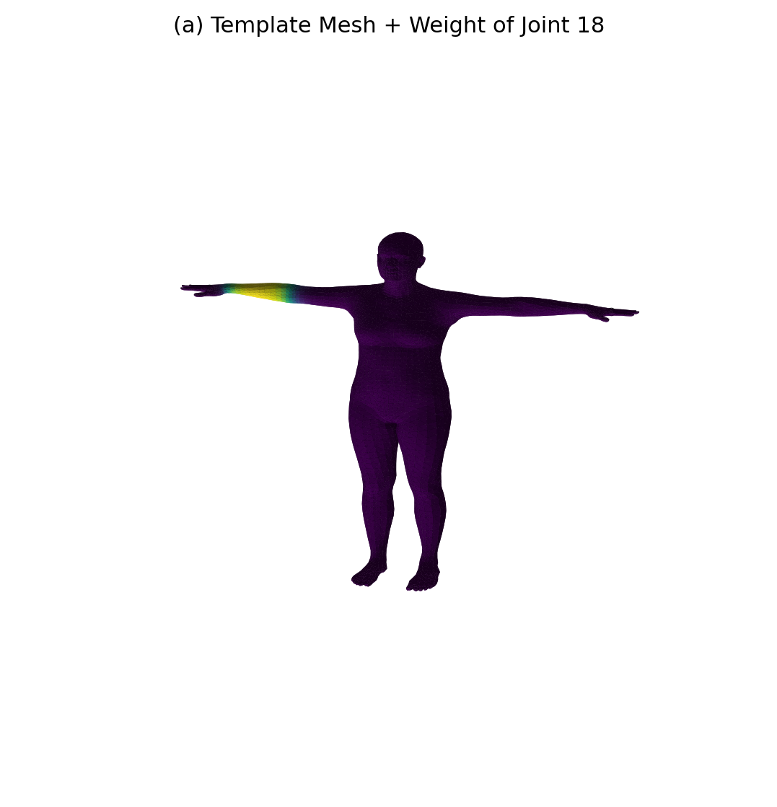
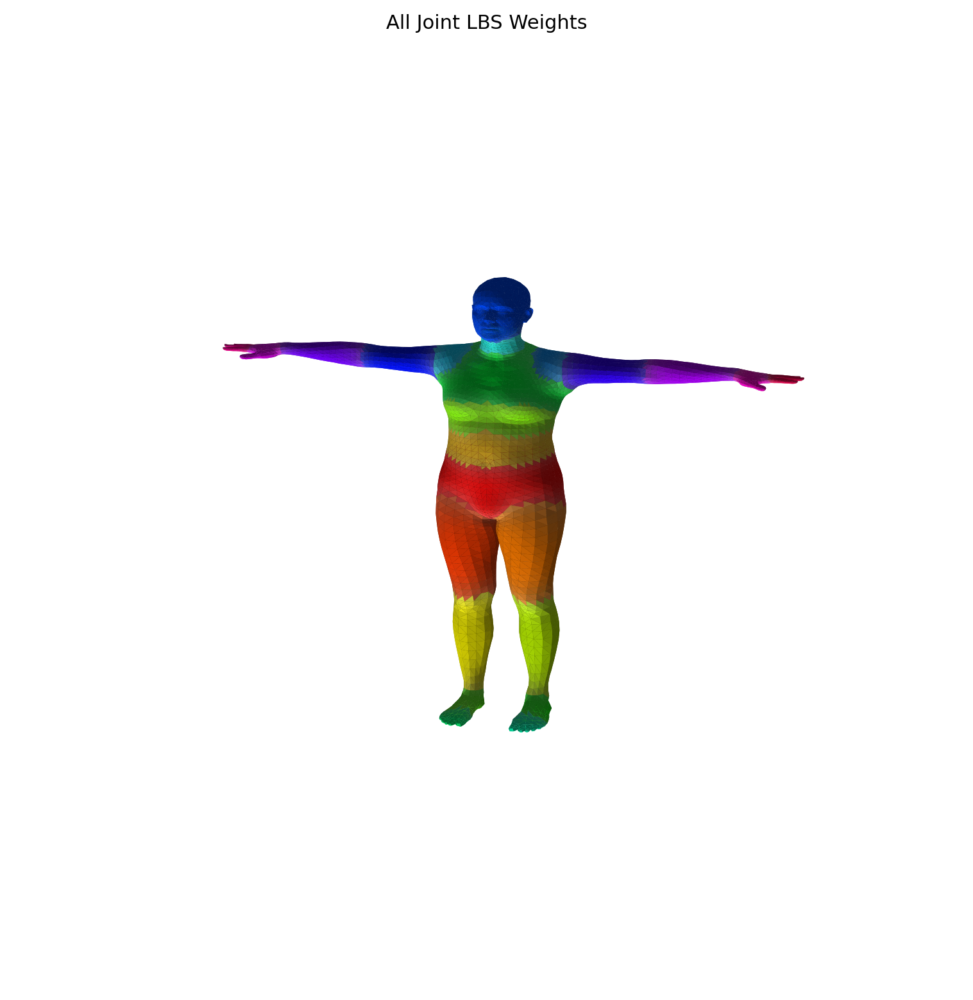
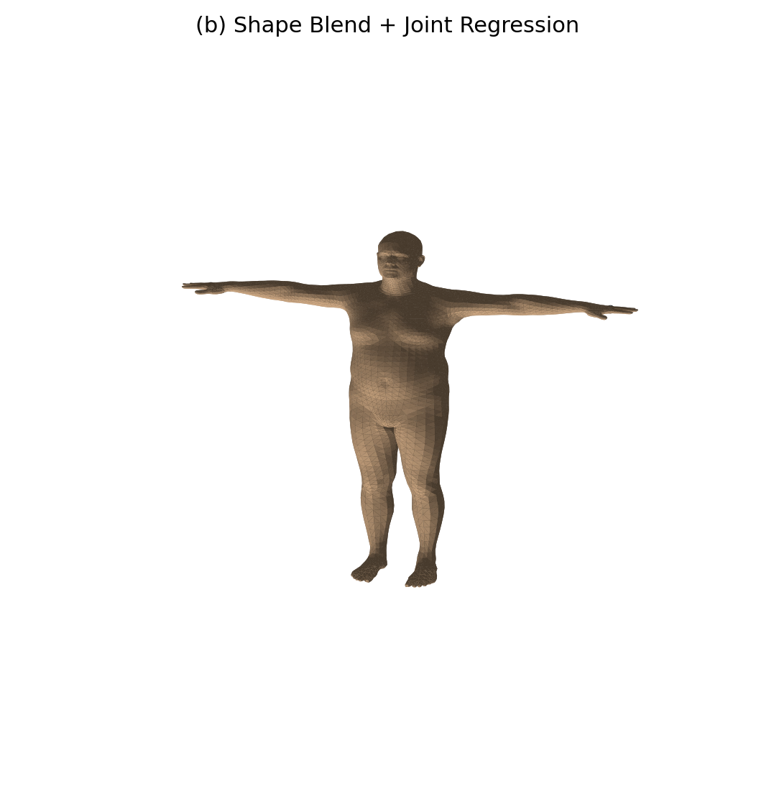
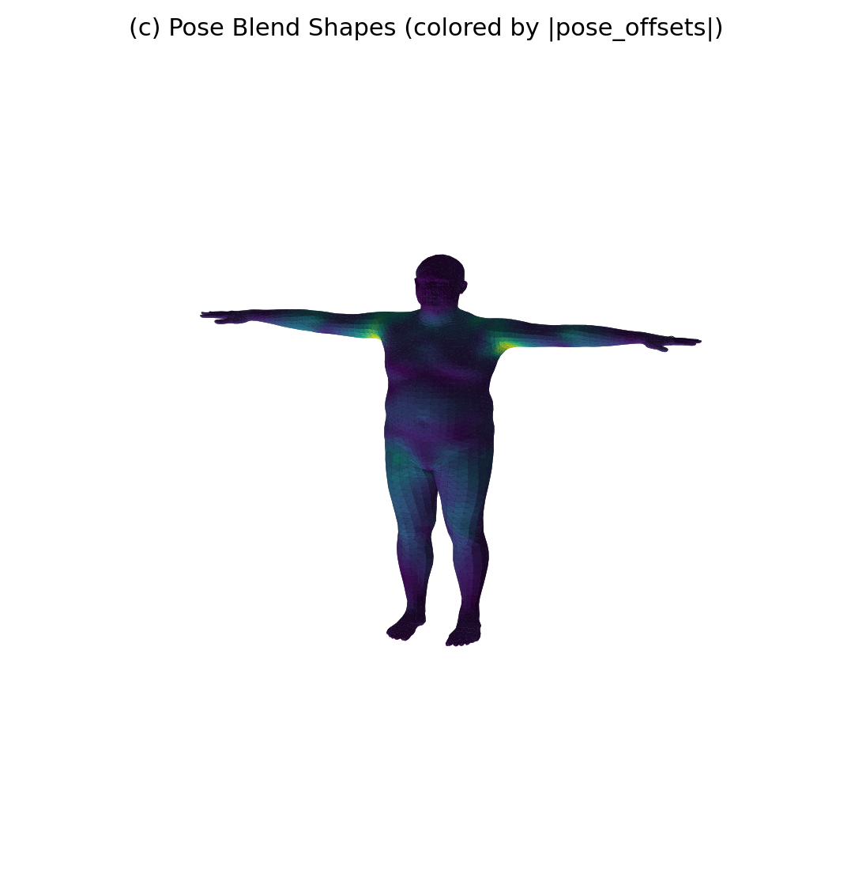
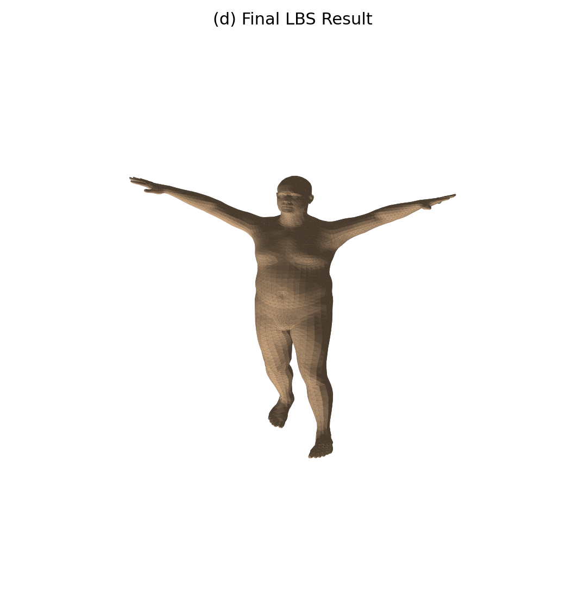
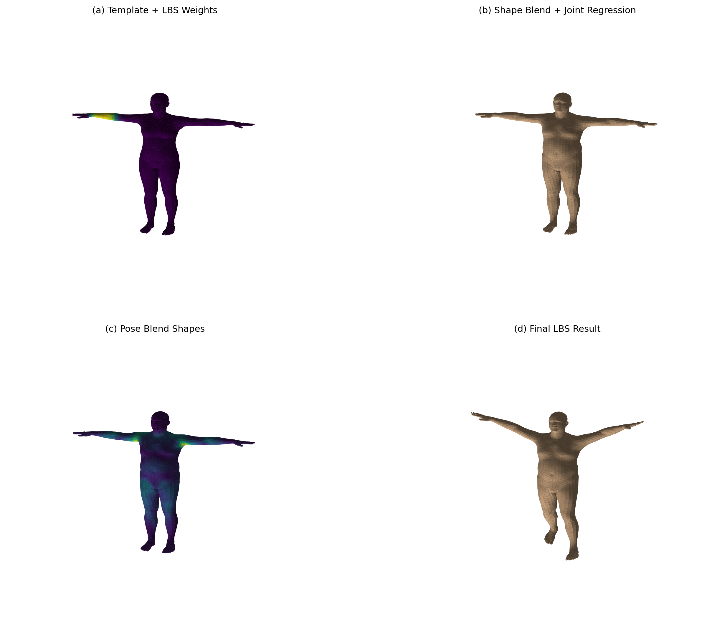
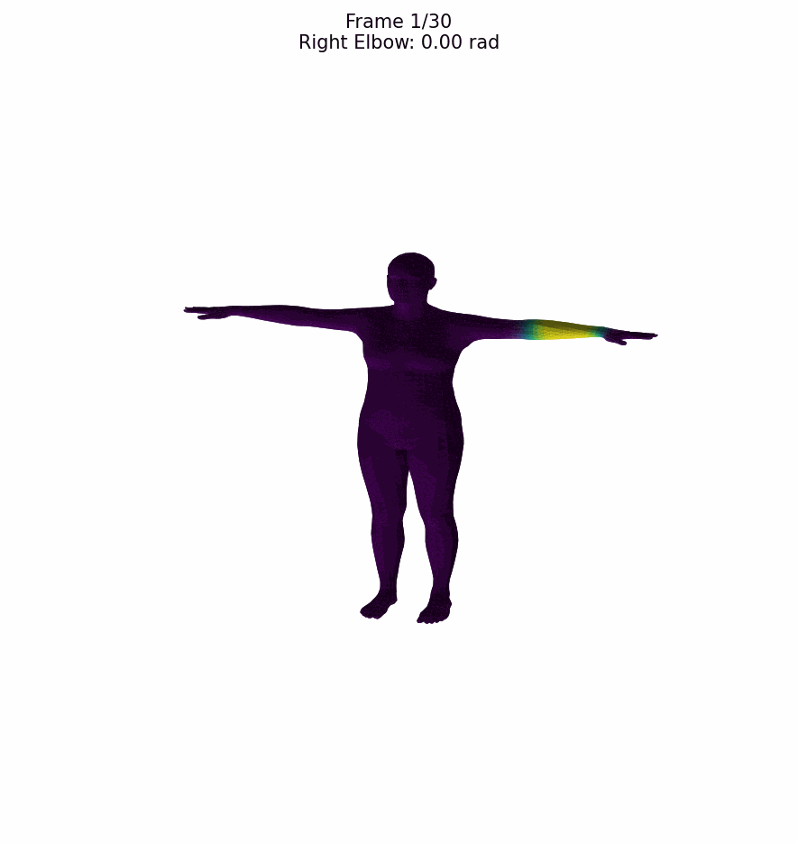

# SMPL 线性混合蒙皮（LBS）实验报告 

## 🎯 一、实验目的

本实验基于 **SMPL** 模型完成一次完整的 **LBS** 蒙皮过程可视化，具体目标包括：

1. **理解参数化人体模型**：掌握模板网格、形状参数、姿态参数、关节回归器和蒙皮权重之间的关系
2. **深入理解 LBS 四个阶段**：模板网格与权重、形状校正 、姿态校正 、 完整蒙皮
3. **学会调用 SMPL 模型**：将官方 `lbs()` 实现中的关键中间量单独提取出来进行可视化
4. **验证手写 LBS 实现**：确保手写代码与官方前向结果的一致性


## 🧠 二、实验原理

### 2.1 LBS 四个阶段详解

#### (a) 模板网格与蒙皮权重

初始状态是模板人体网格 $$\bar{T}$$，通常处于 **T-pose**（站立姿势，双臂平伸）。

每个顶点都带有一组对各关节的影响权重 $$\mathcal{W}$$。如果某个顶点更靠近手臂，那么它通常会更受肩、肘、腕等关节影响。

在 `lbs()` 实现中，最终每个顶点的 4×4 变换矩阵，就是由这些 `lbs_weights` 对各关节变换矩阵加权得到的。

#### (b) 形状校正 $$B_S(\beta)$$

形状参数 $$\beta$$ 控制"这个人长什么样"。例如高矮、胖瘦、肩宽、腿长等，都可以由形状空间中的若干系数表示。

形状校正后，得到：
$$T_{shape} = \bar{T} + B_S(\beta)$$

然后再根据这个已经改变了体型的网格，利用关节回归器得到关节位置：
$$J(\beta) = \mathcal{J}(T_{shape})$$

**实现思路：**
```python
v_shaped = v_template + blend_shapes(beta, shapedirs)
J = vertices2joints(J_regressor, v_shaped)
```

**关键理解：** 关节位置不是固定常数，而是由形状后的网格回归出来的。

#### (c) 姿态校正 $$B_P(\theta)$$ 

蒙皮并非把骨骼旋转一下，皮肤跟着转这么简单。因为人体在弯曲时，肩膀、肘部、膝盖附近会出现额外的几何变化（如肌肉鼓起），仅靠骨骼刚体旋转无法表达。

所以 SMPL 在进入真正的 LBS 前，还会加入一项 **pose blend shape**：
$$T_P(\beta,\theta) = \bar{T} + B_S(\beta) + B_P(\theta)$$

**实现思路：**
```python
rot_mats = batch_rodrigues(...)
pose_feature = (rot_mats[:, 1:, :, :] - ident).view(...)
pose_offsets = torch.matmul(pose_feature, posedirs).view(...)
v_posed = pose_offsets + v_shaped
```

#### (d) 线性混合蒙皮 $$W(\cdot)$$ 

经过上述步骤，我们已经有了：
- 已经考虑形状的关节位置 $$J(\beta)$$
- 已经考虑姿态校正的顶点 $$T_P(\beta,\theta)$$
- 每个顶点对各关节的权重 $$\mathcal{W}$$

之后进入真正的 LBS：
$$v_i' = \sum_{k=1}^{K} w_{ik} \cdot G_k(\theta, J(\beta)) \cdot [v_i^{posed}, 1]^T$$

**实现思路：**
```python
J_transformed, A = batch_rigid_transform(...)
W = lbs_weights.unsqueeze(...).expand(...)
T = torch.matmul(W, A.view(...)).view(..., 4, 4)
v_homo = torch.matmul(T, v_posed_homo.unsqueeze(-1))
verts = v_homo[:, :, :3, 0]
```

**关键理解：** 每个顶点最终不是只跟着一个关节走，而是跟着多个关节做加权平均后的变换。

### 2.2 五个核心对象对照表 
| 对象 | 含义 | 阶段 | 状态 |
|------|------|------|------|
| `v_template` | 模板顶点（T-pose） | (a) | 原始网格，未变形 |
| `v_shaped` | 加了形状形变后的顶点 | (b) | 体型已变化，姿态未变化 |
| `J` | 由 `v_shaped` 回归出的关节 | (b) | 关节位置随体型调整 |
| `v_posed` | 加了姿态校正后的顶点 | (c) | 体型+姿态校正，未蒙皮 |
| `verts` | 完成 LBS 之后的最终顶点 | (d) | 完整蒙皮结果 |

### 2.3 LBS 流程图 

```
v_template ──(形状混合)──→ v_shaped ──(关节回归)──→ J
                              │                        │
                              ↓                        ↓
                    v_shaped + pose_offsets        J_transformed
                              │                        │
                              ↓                        │
                         v_posed ←─────────────────────┘
                              │
                              ↓ (LBS 加权)
                         verts (最终结果)
```

---

## 🛠️ 三、实验环境配置

### 3.1 环境要求 

| 依赖 | 版本 | 用途 |
|------|------|------|
| Python | 3.10+ | 编程语言 |
| PyTorch | CPU 版 | 深度学习框架 |
| NumPy | 最新版 | 数值计算 |
| Matplotlib | 最新版 | 可视化 |
| SMPLX | 最新版 | SMPL 模型加载库 |

### 3.2 安装步骤 

**第一步：安装 Conda**
```bash
# 下载并安装 Miniconda 或 Anaconda
# 官网：https://docs.conda.io/en/latest/miniconda.html
```

**第二步：创建环境**
```bash
conda create -n cg-lbs python=3.10 -y
conda activate cg-lbs
```

**第三步：安装 PyTorch**
```bash
pip install torch
```

**第四步：安装其余依赖**
```bash
pip install numpy matplotlib smplx
```

### 3.3 模型文件准备 

将 SMPL 模型文件 `SMPL_NEUTRAL.pkl` 放置于以下目录：

```
models/smpl/SMPL_NEUTRAL.pkl
```

**模型文件获取方式：**
- 🎓 师大云盘下载
- 🌐 SMPL 官网：https://smpl.is.tue.mpg.de

---

## 📝 四、实验步骤与结果

### 任务 1：成功加载 SMPL，并输出基础信息 

使用 `smplx.create()` 加载 SMPL 模型，指定：
- `model_type='smpl'`
- `gender='neutral'`

**输出结果：**

| 指标 | 值 | 说明 |
|------|-----|------|
| 顶点数 | 6890 | 人体网格的顶点总数 |
| 面片数 | 13776 | 三角形面片数量 |
| 关节数 | 24 | 骨骼关节数量 |
| Betas 维度 | 10 | 形状参数数量 |

**代码实现：**
```python
model = smplx.create(
    model_path=model_dir,
    model_type="smpl",
    gender="neutral",
    ext="pkl",
    num_betas=10,
)
```

### 任务 2：可视化模板网格与蒙皮权重 

#### (1) 单关节权重热力图

**实验要求：**
- 显示模板网格 $$\bar{T}$$
- 从 `lbs_weights` 中选取一个关节（实验中选择关节 ID 18，即左肩）
- 把"该关节对所有顶点的影响权重"可视化成颜色

**输出图片：**



**结果分析：**
- 颜色越明显（接近黄色/白色）表示该关节对该区域的影响越强
- 左肩附近区域颜色最深，表明这些顶点主要受左肩关节控制
- 远离左肩的区域（如腿部）颜色较浅，表明受影响较小

**可视化方法：**
```python
weight_scalar = model.lbs_weights[:, joint_id]  # 获取关节权重
face_colors = get_face_colors_from_vertex_scalar(weight_scalar, faces)  # 转成颜色
```

#### (2) 全关节主导权重分布图

**输出图片：**



**结果分析：**
- 每个面片根据"主导影响关节"分配不同颜色
- 颜色种类表示"主要受哪个关节控制"
- 颜色明暗表示该主导权重的强弱
- 从图中可以看出 SMPL 的模板网格在初始状态下已经携带了完整的关节影响分布信息

### 任务 3：可视化形状校正与关节回归

**实验要求：**
- 设置非零的形状参数 $$\beta$$，前三个参数设置：$$\beta_0=2.0$$,  $$\beta_1=-1.2$$, $$\beta_2=0.8$$
- 计算 `v_shaped`
- 利用 `J_regressor` 从 `v_shaped` 中回归关节 `J`
- 在同一张图中显示形状变化后的网格和回归出的关节点

**输出图片：**



**结果分析：**
- 形状变化后的网格与模板网格相比，体型发生了明显变化（变高、变瘦、肩宽调整）
- 回归出的关节点（白色球体）叠加在身体内部合理位置
- 关节位置随体型变化而调整，例如人物变胖时，肩、膝、髋等关节位置也会相应变化

**关键代码：**
```python
betas = torch.zeros((1, 10))
betas[0, 0] = 2.0   # 第一个形状参数：控制身高
betas[0, 1] = -1.2  # 第二个形状参数：控制胖瘦
betas[0, 2] = 0.8   # 第三个形状参数：控制肩宽

v_shaped = v_template + blend_shapes(betas, shapedirs)
J = vertices2joints(J_regressor, v_shaped)
```

### 任务 4：可视化姿态校正 $$B_P(\theta)$$

**实验要求：**
- 设置非零姿态 $$\theta$$，包括抬手、弯肘、略微扭转躯干
- 将轴角姿态参数转成旋转矩阵
- 构造 `pose_feature = R - I`
- 计算 `pose_offsets`
- 得到 `v_posed = v_shaped + pose_offsets`
- 把 `pose_offsets` 的大小可视化成颜色

**注意：** 这一步**还不是最终蒙皮结果**，只是说明网格本身已经因为姿态发生了额外修正。

**输出图片：**



**姿态参数设置：**
| 关节 | 旋转角度 | 效果 |
|------|----------|------|
| 左肩 | [0.0, 0.0, 0.45] | 左肩外展 |
| 右肩 | [0.0, 0.0, -0.45] | 右肩外展 |
| 左肘 | [0.0, -0.35, 0.0] | 左肘弯曲 |
| 右肘 | [0.0, 0.35, 0.0] | 右肘弯曲 |
| 左髋 | [0.25, 0.0, 0.08] | 左髋旋转 |
| 右髋 | [-0.18, 0.0, -0.08] | 右髋旋转 |
| 左膝 | [0.35, 0.0, 0.0] | 左膝弯曲 |
| 右膝 | [0.20, 0.0, 0.0] | 右膝弯曲 |

**结果分析：**
- 将 `pose_offsets` 的大小可视化成颜色，颜色越深表示偏移量越大
- 姿态校正主要集中在发生弯曲的部位附近（如肘部、膝盖、肩膀）
- 这一阶段尚未进行真正的蒙皮，只是说明网格本身已因姿态发生了额外修正

### 任务 5：可视化完整 LBS 结果

**实验要求：**
- 根据运动学树计算每个关节的全局刚体变换
- 用 `lbs_weights` 对这些关节变换加权
- 得到最终顶点 `verts`
- 可视化最终姿态下的网格与关节位置

**输出图片：**



**结果分析：**
- 人体已进入最终姿态，网格随骨骼运动而变形
- 关节位置也发生了变换（`J_transformed`）
- LBS 保证了皮肤在关节弯曲时的平滑过渡

**关键代码：**
```python
J_transformed, A = batch_rigid_transform(rot_mats, J, model.parents)
W = model.lbs_weights.unsqueeze(0).expand(1, -1, -1)
T = torch.matmul(W, A.view(1, num_joints, 16)).view(1, -1, 4, 4)
v_homo = torch.matmul(T, v_posed_homo.unsqueeze(-1))
verts = v_homo[:, :, :3, 0]
```

### 任务 6：生成总对比图

将四个阶段排成一张 2×2 的对比图，标题清楚标出：
- (a) template + weights
- (b) shape + joints
- (c) pose offsets
- (d) final skinned mesh

**输出图片：**



**对比分析：**
| 阶段 | 标题 | 状态描述 |
|------|------|----------|
| (a) | Template + LBS Weights | 网格处于 T-pose，颜色表示关节影响权重 |
| (b) | Shape Blend + Joint Regression | 体型发生变化，关节位置相应调整 |
| (c) | Pose Blend Shapes | 网格因姿态发生局部修正 |
| (d) | Final LBS Result | 网格随骨骼完成最终变形 |

### 任务 7：手写 LBS 与官方前向结果一致性验证 

**实验要求：**
- 使用与手写实现完全相同的 `betas`、`global_orient` 和 `body_pose`
- 调用官方模型前向，得到 `output.vertices`
- 将手写实现得到的 `verts` 与官方结果逐顶点比较
- 计算误差指标：平均绝对误差、最大绝对误差
- 将误差结果保存到 `summary.txt`

**误差指标：**

| 指标 | 值 | 说明 |
|------|-----|------|
| 平均绝对误差（MAE） | **0.0000000000** | 所有顶点误差的平均值 |
| 最大绝对误差（Max AE） | **0.0000000000** | 单个顶点的最大误差 |

**结果分析：**
- 手写 LBS 实现与官方前向结果**完全一致**，误差为 0
- 证明手写实现准确复现了 SMPL 的 LBS 算法

**验证代码：**
```python
# 手写 LBS
data = compute_manual_lbs(model, betas, global_orient, body_pose)
manual_verts = data["verts"]

# 官方前向
output = model(betas=betas, global_orient=global_orient, body_pose=body_pose)
official_verts = output.vertices

# 计算误差
diff = torch.abs(manual_verts - official_verts)
mean_err = diff.mean().item()
max_err = diff.max().item()
```

---

## 🎬 五、选做内容：姿态动画

### 5.1 动画设置 

| 设置项 | 值 | 说明 |
|--------|-----|------|
| 形状参数 | `betas` 全为 0 | 固定体型不变 |
| 动画关节 | 右肘关节（ID 19） | 让肘部弯曲 |
| 旋转范围 | 0 → 1.5 弧度（约 86 度） | 逐渐弯曲 |
| 帧数 | 30 帧 | 足够平滑的动画 |
| 帧率 | 30 FPS | 流畅度适中 |

### 5.2 输出结果 

**输出动画：**



**输出文件：**
- `outputs2/animation.gif` 🎉 - 30帧 GIF 动画
- `outputs2/animation.mp4` 🎬 - MP4 视频文件
- `outputs2/frames/frame_000.png` ~ `frame_029.png` 🖼️ - 30张帧图片

### 5.3 观察效果 👀

在动画中可以观察到：
1. 🦾 右肘关节逐渐弯曲
2. 🎨 权重区域（颜色部分）随骨骼运动被平滑带动
3. 📍 靠近肘部的区域始终显示较强的权重颜色
4. ✅ LBS 保证了皮肤在关节弯曲时平滑过渡，没有撕裂或突变

### 5.4 动画原理 💡

动画的核心思想是：
- 固定形状参数，只改变姿态参数
- 在每一帧中，计算当前姿态下的 LBS 结果
- 将每一帧的结果保存为图片，最后合成 GIF/MP4

**关键代码：**
```python
for frame_idx in range(num_frames):
    progress = frame_idx / (num_frames - 1)
    current_angle = start_angle + progress * (end_angle - start_angle)
    
    body_pose[0, joint_start:joint_start+3] = torch.tensor([current_angle, 0, 0])
    data = compute_manual_lbs(model, betas, global_orient, body_pose)
    
    # 保存帧图片...
```

---

## 💡 六、思考问题回答

### 6.1 关于蒙皮权重 🎨

**Q：为什么一个顶点不只受一个关节影响？**

**A：** 如果一个顶点只受一个关节影响，当骨骼运动时，该顶点会完全跟随该关节运动，导致关节附近出现**"撕裂"现象**（皮肤在关节处断开）。多个关节共同影响可以实现平滑的皮肤过渡，使蒙皮效果更加自然。

**Q：如果一个顶点的权重几乎全给了某一个关节，会出现什么效果？**

**A：** 该顶点会几乎完全跟随该关节运动，在关节弯曲时可能出现皮肤**不自然的拉伸或挤压**，类似于"刚体"运动，缺乏弹性。

**Q：如果权重分布很平均，又会出现什么效果？**

**A：** 顶点会被多个关节共同影响，运动更平滑，但可能导致关节处**缺乏刚性**，出现"果冻"效果（皮肤过于柔软，没有骨骼支撑的感觉）。

### 6.2 关于关节回归 🔄

**Q：为什么关节位置要从形状后的网格回归，而不是固定不变？**

**A：** 因为关节位置依赖于人体体型。当人物变胖/变瘦时，肩、膝、髋等关节的位置也会相应变化。如果关节位置固定不变，会导致骨骼与皮肤**不匹配**（骨骼穿模或皮肤悬空）。

**Q：如果人物变胖/变瘦，肩、膝、髋等关节的大致位置会不会变化？**

**A：** 会变化。例如，人物变胖时，身体变宽，肩关节之间的距离也会增大；人物变高时，髋关节到膝关节的距离也会增加。

**Q：`v_template` 与 `v_shaped` 的差别是什么？**

**A：** `v_template` 是原始模板网格（标准体型），`v_shaped` 是经过形状参数调整后的网格（特定体型）。两者的差别在于是否应用了形状混合（shape blend shapes）。

### 6.3 关于姿态校正 🦾

**Q：为什么 LBS 之前还要加 pose corrective？**

**A：** 人体在弯曲时，关节附近会出现肌肉鼓起等几何变化，仅靠骨骼刚体旋转无法准确表达。Pose corrective 可以模拟这些细节变化，使蒙皮结果更加真实。

**Q：如果去掉 pose_offsets，最终人体弯曲处会出现什么问题？**

**A：** 关节弯曲处会出现**不自然的凹陷或尖锐**，无法模拟真实人体的肌肉形态。例如，肘部弯曲时，内侧会出现凹陷，外侧会凸起，这些都需要 pose_offsets 来模拟。

**Q：`v_shaped` 与 `v_posed` 的本质区别是什么？**

**A：** `v_shaped` 只考虑了形状变化，姿态仍为 T-pose；`v_posed` 在形状变化的基础上，还考虑了姿态校正（pose blend shapes），网格已经因姿态发生了局部修正。

### 6.4 关于线性混合蒙皮 ✨

**Q：`J` 和 `J_transformed` 有什么区别？**

**A：** `J` 是回归出的关节位置（在形状空间中，未经过运动学变换），而 `J_transformed` 是经过运动学链变换后的关节位置（在世界空间中，考虑了父关节的变换）。

**Q：为什么最终顶点要写成加权和，而不是只选择最大权重的关节？**

**A：** 使用加权和可以实现平滑的皮肤过渡，避免关节处的撕裂。如果只选择最大权重的关节，会导致皮肤在关节边界处**不连续**（跳变），蒙皮效果非常生硬。

---

## ✨ 七、结论

本实验成功完成了 SMPL 模型的 LBS 蒙皮过程可视化，主要成果包括：

| 成果 | 状态 | 说明 |
|------|------|------|
| ✅ 加载 SMPL 模型 | 完成 | 输出了顶点数、面片数、关节数等基础信息 |
| ✅ LBS 四个阶段可视化 | 完成 | 模板网格、形状校正、姿态校正、完整蒙皮 |
| ✅ 手写 LBS 实现 | 完成 | 与官方前向结果完全一致（误差为 0） |
| ✅ 姿态动画 | 完成 | 生成了 GIF 和 MP4 动画 |
| ✅ 思考问题回答 | 完成 | 全部思考问题的详细解答 |

**实验结果表明：** Linear Blend Skinning 通过形状混合、姿态校正和线性权重混合，能够实现平滑、自然的人体蒙皮效果。这是计算机图形学中人体动画的基础技术，广泛应用于游戏、电影和虚拟现实等领域。

---

## 📂 八、项目结构

```
cg_lab8/                              # 项目根目录
├── run_lbs_lab.py                    # LBS 实验主程序
├── run_animation.py                  # 姿态动画脚本
├── src/
│   └── lbs.py                        # LBS 相关工具函数
├── models/                           # 模型文件目录
│   └── smpl/
│       └── SMPL_NEUTRAL.pkl          # SMPL 模型文件
├── outputs/                          # LBS 实验输出
│   ├── stage_a_template_weights.png  # (a) 模板网格 + 权重
│   ├── stage_b_shaped_joints.png     # (b) 形状校正 + 关节回归
│   ├── stage_c_pose_offsets.png      # (c) 姿态校正
│   ├── stage_d_lbs_result.png        # (d) 最终蒙皮结果
│   ├── comparison_grid.png           # 四阶段对比图
│   ├── all_joint_weights.png         # 全关节权重分布图
│   └── summary.txt                   # 误差验证结果
├── outputs2/                         # 动画输出
│   ├── animation.gif                 # GIF 动画
│   ├── animation.mp4                 # MP4 视频
│   └── frames/                       # 帧图片目录
├── pyproject.toml                    # 项目依赖配置
├── .gitignore                        # Git 忽略配置
└── README.md                         # 本实验报告
```

---

## 🚀 九、运行命令

### 运行 LBS 实验

```bash
python run_lbs_lab.py --model-dir ./models --out-dir ./outputs --joint-id 18
```

**参数说明：**
- `--model-dir`：模型目录，内部应包含 `smpl/SMPL_NEUTRAL.pkl`
- `--out-dir`：输出目录
- `--joint-id`：要可视化权重的关节编号（0-23）

### 运行姿态动画

```bash
python run_animation.py --model-dir ./models --out-dir ./outputs2 --num-frames 30 --fps 30
```

**参数说明：**
- `--model-dir`：模型目录
- `--out-dir`：输出目录
- `--num-frames`：动画帧数
- `--fps`：帧率

---
